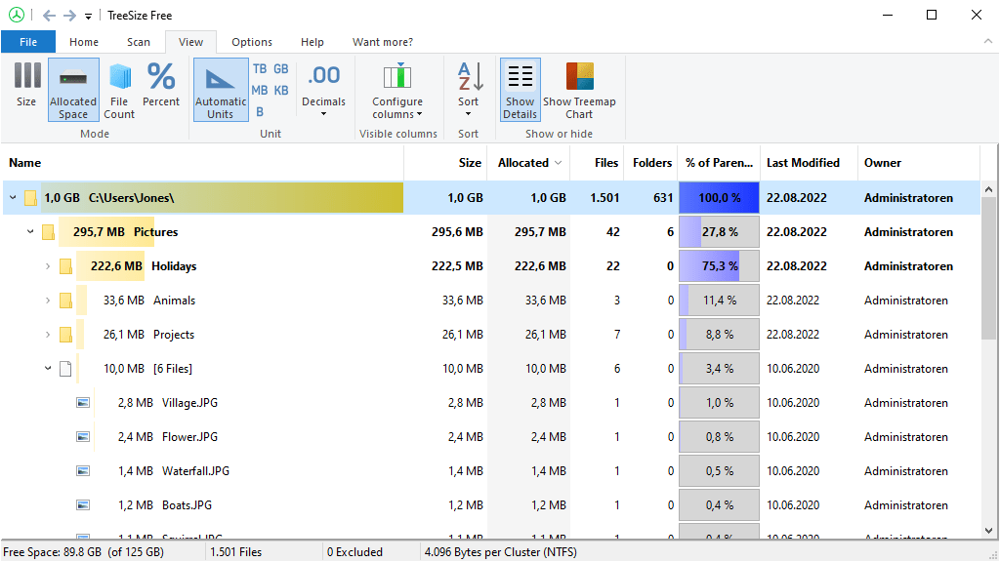

# See files in tree view

To Check disk space and remove unwanted files and folders see it in very neat way this software is vary useful.

[Referance](https://www.jam-software.com/treesize_free)

It will quickly scan directories and show how much space it's consuming and it shows the directories in accending order by size. Fill free to test it. This file containes refrence link which contains website of this software and there is a download link at the end of the file. Here are some photos.

[DOWNLOAD](https://customers.jam-software.de/downloadTrial.php?language=EN&article_no=80)
